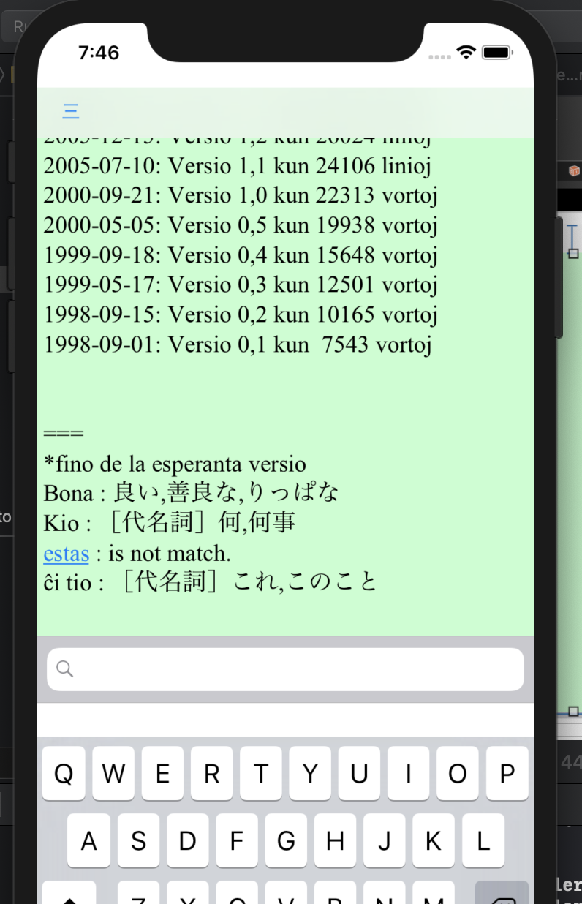
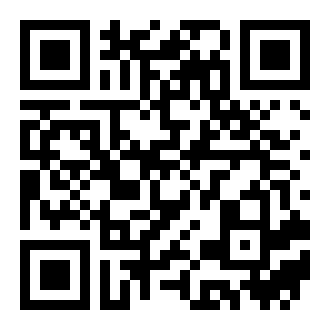

lina\_dicto\_for\_ios
====
  

\- Dictionary for Japanese and Esperanto -

# About
lina\_dicto\_for\_ios  は日本語/Esperanto変換を検索できる辞書アプリケーションです。  

  

# get App
[App Storeにて公開中（フリー）]( https://apps.apple.com/us/app/lina-dicto/id1474809778 )  
App Store install QR code.  
  

# 辞書データについて
外部の辞書データを改変し収録させて頂きました。感謝いたします。  
[辞書データのREADME](。./lina_dicto/lina_dicto/dictionary/README.md)参照  

# Donate/Buy
@todo  
Online store [project daisy bell][pixiv_booth_project_daisy_bell] and [RuneAMN fonts Pro][gumroad_runeamn_fonts_pro] is product by daisy bell.  
And please contact.  

# Other variation
[lina\_dicto (desktop win/mac/linux)](https://github.com/MichinariNukazawa/lina_dicto)  
[lina\_dicto for android](https://github.com/MichinariNukazawa/lina_dicto_for_android)  
[lina\_dicto for webextension](https://github.com/MichinariNukazawa/lina_dicto_for_webextension)  

# Develop
## Project goal
初学者に使いやすく、見た目がよい、クロスプラットフォームな日本語/Esperanto変換辞書アプリケーションを提供する。  

## License
Clause-2 BSD License  
Exclude dictionary data.(辞書ファイルは辞書ファイル毎のライセンスに準じます)  

# Contact
mail: [michinari.nukazawa@gmail.com][mailto]  
twitter: [@MNukazawa][twitter]  

Develop by Michinari.Nukazawa, in project "daisy bell".  

[pixiv_booth_project_daisy_bell]: https://daisy-bell.booth.pm/
[gumroad_runeamn_fonts_pro]: https://gumroad.com/l/UNWF
[mailto]: mailto:michinari.nukazawa@gmail.com
[twitter]: https://twitter.com/MNukazawa

